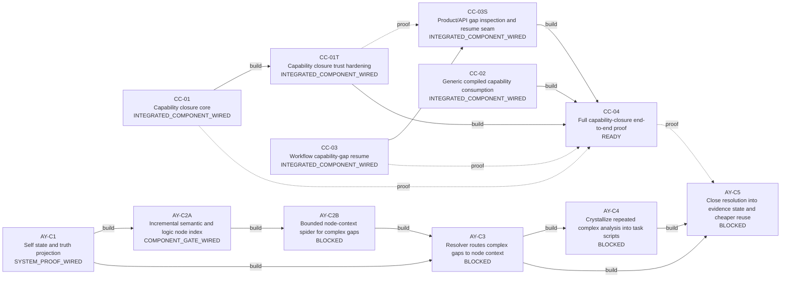

# Development Control Map

<!-- Generated from data/work_graph.csv + data/work_evidence.csv by scripts/work_map.py. -->

O CSV declara trabalho e evidência; estado operacional é derivado. Merge, teste existente e prova de sistema são dimensões separadas.

[Repository Map](REPOSITORY_MAP.md) · [Product Intent](PRODUCT_INTENT.md) · [Decisions](DECISIONS.md)

## Agora

- Ready: `CC-04`
- Dívida de verificação: nenhuma
- Bloqueados: `AY-C2B`, `AY-C3`, `AY-C4`, `AY-C5`
- Conflitos de ownership acionáveis: 0

## Grafo



## Work board

| ID | Implementação | Teste | Gate | Merge | Prova sistema | Estado | Next |
|---|---:|---:|---:|---:|---:|---|---|
| `CC-01` | ✓ | ✓ | ✓ | ✓ | — | `INTEGRATED_COMPONENT_WIRED` | add/wire system proof |
| `CC-01T` | ✓ | ✓ | ✓ | ✓ | — | `INTEGRATED_COMPONENT_WIRED` | add/wire system proof |
| `CC-03` | ✓ | ✓ | ✓ | ✓ | — | `INTEGRATED_COMPONENT_WIRED` | add/wire system proof |
| `CC-03S` | ✓ | ✓ | ✓ | ✓ | — | `INTEGRATED_COMPONENT_WIRED` | add/wire system proof |
| `CC-02` | ✓ | ✓ | ✓ | ✓ | — | `INTEGRATED_COMPONENT_WIRED` | add/wire system proof |
| `CC-04` | — | — | — | — | — | `READY` | implement |
| `AY-C1` | ✓ | ✓ | ✓ | ✓ | ✓ | `SYSTEM_PROOF_WIRED` | observe system proof execution |
| `AY-C2A` | ✓ | ✓ | ✓ | — | ✓ | `COMPONENT_GATE_WIRED` | integrate |
| `AY-C2B` | ✓ | ✓ | ✓ | — | ✓ | `BLOCKED` | wait for AY-C2A |
| `AY-C3` | ✓ | ✓ | ✓ | — | ✓ | `BLOCKED` | wait for AY-C2B |
| `AY-C4` | — | ✓ | ✓ | — | ✓ | `BLOCKED` | wait for AY-C3 |
| `AY-C5` | — | — | — | — | — | `BLOCKED` | wait for AY-C3,AY-C4 |

## Dívida de verificação

Nenhuma.

## Paralelismo

Nenhuma colisão de ownership entre trabalhos acionáveis.

## Evidência append-only

| Item | Tipo | Referência | Resultado | Escopo | Data | Nota |
|---|---|---|---|---|---|---|
| `CC-01` | `merged_pr` | PR#71 | `pass` | integration | 2026-10-02 | Capability closure core merged; PR completion report records focused tests and Trust Gate pass. |
| `CC-03` | `merged_pr` | PR#72 | `pass` | integration | 2026-10-02 | Workflow resume semantics merged; PR completion report records focused tests. |
| `CC-03S` | `merged_pr` | PR#73 | `pass` | integration | 2026-10-02 | Gap inspection and safe replan seam merged into main. |
| `CC-01T` | `merged_pr` | PR#74 | `pass` | integration | 2026-10-02 | Trust hardening merged; PR completion report records capability-closure tests and Trust Gate pass. |
| `CC-02` | `merged_pr` | PR#76 | `pass` | integration | 2026-10-02 | Generic compiled capability consumption merged into main. |
| `CC-02` | `ci_check` | PR#76@b9b751ef3900f2819f49ac16ee561c590f62cd53:Trust Gate | `pass` | repository-gate | 2026-10-02 | Exact-head Trust Gate passed, but test_compiler_capability_binding.py is not yet listed in scripts/trust_gate.py; do not treat this as component-proof coverage. |
| `CC-02` | `ci_check` | PR#76@b9b751ef3900f2819f49ac16ee561c590f62cd53:Documentation map | `fail` | documentation | 2026-10-02 | Documentation map failed on the CC-02 head; unrelated to runtime behavior but preserved as evidence. |
| `AY-C1` | `merged_pr` | PR#81 | `pass` | integration | 2026-10-02 | AY self-state/resolver/orchestrator and concrete task scripts merged; canonical Trust Gate passed on Ubuntu and Windows before merge. |

## Comandos

```bash
python scripts/work_map.py status
python scripts/work_map.py next
python scripts/work_map.py inspect CC-04
python scripts/work_map.py render
python scripts/work_map.py check
```

Fonte: `data/work_graph.csv`. Evidência: `data/work_evidence.csv`. Projeção tabular: `docs/WORK_STATUS.csv`.
