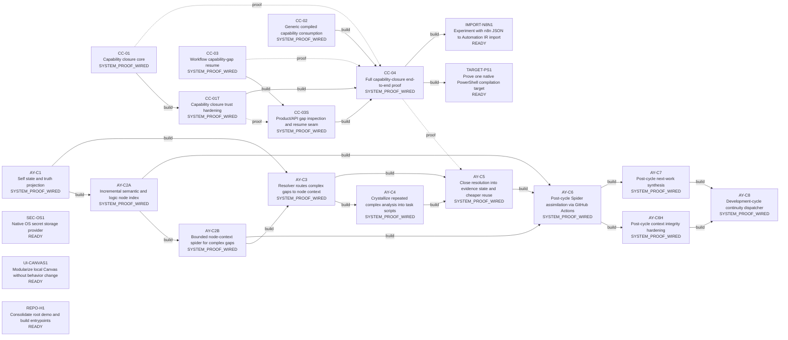

# Development Control Map

<!-- Generated from data/work_graph.csv + data/work_evidence.csv by scripts/work_map.py. -->

O CSV declara trabalho e evidência; estado operacional é derivado. Merge, teste existente e prova de sistema são dimensões separadas.

[Repository Map](REPOSITORY_MAP.md) · [Product Intent](PRODUCT_INTENT.md) · [Decisions](DECISIONS.md)

## Agora

- Ready: `SEC-OS1`, `UI-CANVAS1`, `REPO-H1`, `TARGET-PS1`, `IMPORT-N8N1`
- Dívida de verificação: nenhuma
- Bloqueados: nenhum
- Conflitos de ownership acionáveis: 0

## Grafo



## Work board

| ID | Implementação | Teste | Gate | Merge | Prova sistema | Estado | Next |
|---|---:|---:|---:|---:|---:|---|---|
| `CC-01` | ✓ | ✓ | ✓ | ✓ | ✓ | `SYSTEM_PROOF_WIRED` | observe system proof execution |
| `CC-01T` | ✓ | ✓ | ✓ | ✓ | ✓ | `SYSTEM_PROOF_WIRED` | observe system proof execution |
| `CC-03` | ✓ | ✓ | ✓ | ✓ | ✓ | `SYSTEM_PROOF_WIRED` | observe system proof execution |
| `CC-03S` | ✓ | ✓ | ✓ | ✓ | ✓ | `SYSTEM_PROOF_WIRED` | observe system proof execution |
| `CC-02` | ✓ | ✓ | ✓ | ✓ | ✓ | `SYSTEM_PROOF_WIRED` | observe system proof execution |
| `CC-04` | ✓ | ✓ | ✓ | ✓ | ✓ | `SYSTEM_PROOF_WIRED` | observe system proof execution |
| `AY-C1` | ✓ | ✓ | ✓ | ✓ | ✓ | `SYSTEM_PROOF_WIRED` | observe system proof execution |
| `AY-C2A` | ✓ | ✓ | ✓ | ✓ | ✓ | `SYSTEM_PROOF_WIRED` | observe system proof execution |
| `AY-C2B` | ✓ | ✓ | ✓ | ✓ | ✓ | `SYSTEM_PROOF_WIRED` | observe system proof execution |
| `AY-C3` | ✓ | ✓ | ✓ | ✓ | ✓ | `SYSTEM_PROOF_WIRED` | observe system proof execution |
| `AY-C4` | ✓ | ✓ | ✓ | ✓ | ✓ | `SYSTEM_PROOF_WIRED` | observe system proof execution |
| `AY-C5` | ✓ | ✓ | ✓ | ✓ | ✓ | `SYSTEM_PROOF_WIRED` | observe system proof execution |
| `AY-C6` | ✓ | ✓ | ✓ | ✓ | ✓ | `SYSTEM_PROOF_WIRED` | observe system proof execution |
| `AY-C6H` | ✓ | ✓ | ✓ | ✓ | ✓ | `SYSTEM_PROOF_WIRED` | observe system proof execution |
| `AY-C7` | ✓ | ✓ | ✓ | ✓ | ✓ | `SYSTEM_PROOF_WIRED` | observe system proof execution |
| `AY-C8` | ✓ | ✓ | ✓ | ✓ | ✓ | `SYSTEM_PROOF_WIRED` | observe system proof execution |
| `SEC-OS1` | — | — | — | — | — | `READY` | implement |
| `UI-CANVAS1` | — | — | — | — | — | `READY` | implement |
| `REPO-H1` | — | — | — | — | — | `READY` | implement |
| `TARGET-PS1` | — | — | — | — | — | `READY` | implement |
| `IMPORT-N8N1` | — | — | — | — | — | `READY` | implement |

## Dívida de verificação

Nenhuma.

## Paralelismo

Nenhuma colisão de ownership entre trabalhos acionáveis.

## Evidência append-only

| Item | Tipo | Referência | Resultado | Escopo | Data | Nota |
|---|---|---|---|---|---|---|
| `CC-01` | `merged_pr` | PR#71 | `pass` | integration | 2026-10-02 | Capability closure core merged; PR completion report records focused tests and Trust Gate pass. |
| `CC-03` | `merged_pr` | PR#72 | `pass` | integration | 2026-10-02 | Workflow resume semantics merged; PR completion report records focused tests. |
| `CC-03S` | `merged_pr` | PR#73 | `pass` | integration | 2026-10-02 | Gap inspection and safe replan seam merged into main. |
| `CC-01T` | `merged_pr` | PR#74 | `pass` | integration | 2026-10-02 | Trust hardening merged; PR completion report records capability-closure tests and Trust Gate pass. |
| `CC-02` | `merged_pr` | PR#76 | `pass` | integration | 2026-10-02 | Generic compiled capability consumption merged into main. |
| `CC-02` | `ci_check` | PR#76@b9b751ef3900f2819f49ac16ee561c590f62cd53:Trust Gate | `pass` | repository-gate | 2026-10-02 | Exact-head Trust Gate passed, but test_compiler_capability_binding.py is not yet listed in scripts/trust_gate.py; do not treat this as component-proof coverage. |
| `CC-02` | `ci_check` | PR#76@b9b751ef3900f2819f49ac16ee561c590f62cd53:Documentation map | `fail` | documentation | 2026-10-02 | Documentation map failed on the CC-02 head; unrelated to runtime behavior but preserved as evidence. |
| `AY-C1` | `merged_pr` | PR#81 | `pass` | integration | 2026-10-02 | AY self-state/resolver/orchestrator and concrete task scripts merged; canonical Trust Gate passed on Ubuntu and Windows before merge. |
| `AY-C2A` | `merged_pr` | PR#82 | `pass` | integration | 2026-10-02 | Incremental semantic/logic node index merged; changed-file reuse and node-kind extraction are covered by Trust Gate. |
| `AY-C2B` | `merged_pr` | PR#82 | `pass` | integration | 2026-10-02 | Bounded node-context spider merged over derived graph; semantic seed, limits and empty-context behavior passed Trust Gate on Ubuntu and Windows. |
| `CC-04` | `merged_pr` | PR#84 | `pass` | integration | 2026-10-02 | Full A→gap→authorized closure→validated memory→resume→compile→run and B→reuse→compile→run proof merged; exact-head Trust Gate passed on Ubuntu and Windows. |
| `AY-C3` | `merged_pr` | PR#84 | `pass` | integration | 2026-10-02 | AY NEED_CONTEXT now routes through the bounded node-context spider as a safe read-only mechanism; Trust Gate passed on Ubuntu and Windows. |
| `AY-C4` | `merged_pr` | PR#84 | `pass` | integration | 2026-10-02 | Repeated IR-vs-compiler analysis crystallized into scripts/repo_contract_diff.py with deterministic structured output and gated proof. |
| `AY-C5` | `merged_pr` | PR#84 | `pass` | integration | 2026-10-02 | Verified successful derived results can be cached with evidence refs and source fingerprint; equivalent next resolution reuses only matching-fingerprint state. |
| `AY-C6` | `merged_pr` | PR#86 | `pass` | integration | 2026-10-02 | Post-cycle Spider workflow merged to main with read-only GitHub Actions orchestration. |
| `AY-C6` | `ci_check` | Actions#37075409824 | `pass` | system-proof | 2026-10-02 | Successful main Trust Gate automatically triggered Post-cycle Spider; baseline graph cache was saved and post-cycle-context artifact 11256660815 was published for SHA 324ae3e8c8e29ed02d4117adf51eb260f475f283. |
| `AY-C6` | `ci_check` | Actions#37075802268 | `pass` | system-proof | 2026-10-02 | Post-cycle Spider restored cache node-context-main-285bc29..., incrementally reparsed 3 changed eligible files, produced 15 context nodes/14 edges/8 semantic labels/1 logic node without truncation, and published artifact 11256441692. |
| `AY-C7` | `merged_pr` | PR#90 | `pass` | integration | 2026-10-02 | Post-cycle next-work planner merged; exact-head Trust Gate passed and Actions#37076501876 generated next_cycle.json from canonical work state plus bounded Spider context. |
| `AY-C7` | `ci_check` | Actions#37076501876 | `pass` | system-proof | 2026-10-02 | After trusted main SHA 5186125b..., Post-cycle Spider restored prior context and next_cycle_plan selected AY-C7/integrate because merge evidence was not yet canonical, proving state-sensitive planning rather than a hardcoded next task. |
| `AY-C6H` | `merged_pr` | PR#93 | `pass` | integration | 2026-10-02 | Context-integrity hardening merged: node-context schema v2, derivation-contract fingerprint, cache-key scoping and fail-closed rebuild semantics. |
| `AY-C6H` | `ci_check` | Actions#37080065262 | `pass` | system-proof | 2026-10-02 | Trusted main cycle 42f08b... completed Post-cycle Spider with the hardened context contract, published refreshed context and generated next_cycle.json successfully. |
| `AY-C8` | `merged_pr` | PR#93 | `pass` | integration | 2026-10-02 | Executor-agnostic continuity dispatcher and structured CI failure handoff merged; deterministic PR checks and Trust Gate passed on Ubuntu and Windows. |
| `AY-C8` | `ci_check` | Actions#37080083310 | `pass` | system-proof | 2026-10-02 | After trusted Post-cycle Spider output, Development cycle dispatcher consumed next_cycle.json and emitted STOP_NEEDS_EXECUTOR for AY-C6H because no executor is registered; workflow completed successfully and published the dispatch envelope. |

## Comandos

```bash
python scripts/work_map.py status
python scripts/work_map.py next
python scripts/work_map.py inspect CC-04
python scripts/work_map.py render
python scripts/work_map.py check
```

Fonte: `data/work_graph.csv`. Evidência: `data/work_evidence.csv`. Projeção tabular: `docs/WORK_STATUS.csv`.
